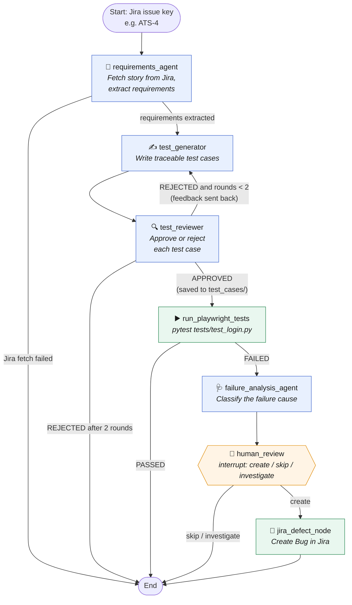
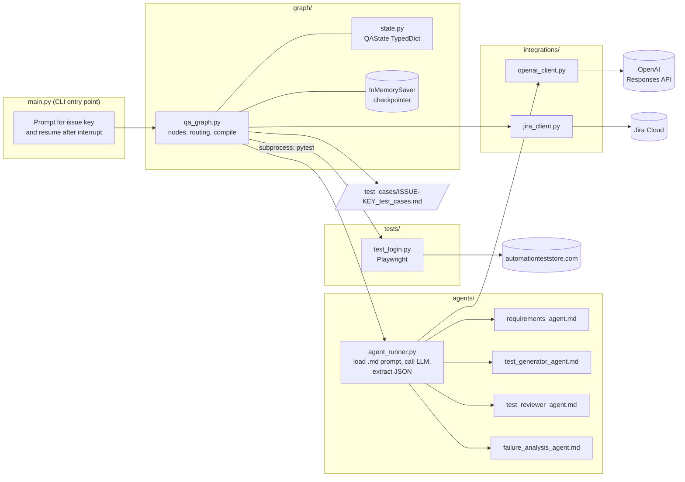

# Automation Test Store — AI-Driven QA Pipeline

An agentic QA workflow built with **LangGraph**, **OpenAI**, **Playwright** and **Jira**.
Give it a Jira user story key, and it:

1. Pulls the story from Jira and extracts **only** the requirements that are actually written in it
2. Generates traceable test cases from those requirements
3. Has an independent reviewer agent approve or reject the test cases (rejected cases go back for revision)
4. Runs the Playwright test suite against [automationteststore.com](https://automationteststore.com)
5. If a test fails, analyzes the failure and **pauses for a human** to decide whether to log a defect
6. Creates a Jira **Bug** only when the human says so

The design principle throughout is *no invented requirements*: every agent is instructed to work only from its input, flag gaps instead of filling them, and leave the final defect call to a person.

---

## Architecture

### Pipeline flow (LangGraph state machine)



🟦 LLM agent nodes 🟩 tool/integration nodes 🟧 human-in-the-loop

### Components and external services



---

## How it works

### Shared state

Every node reads from and writes to a single `QAState` dictionary (`graph/state.py`). LangGraph merges each node's returned dict into that state, so later nodes can see what earlier ones produced.

| Key | Set by | Purpose |
|---|---|---|
| `issue_key` | `main.py` | Jira story to test (the only required input) |
| `requirements` | requirements_agent | Structured requirements with source quotes |
| `generated_tests` | test_generator | Test cases (with REQ/AC traceability) |
| `reviewed_tests`, `review_decision`, `review_feedback`, `review_attempts` | test_reviewer | Review verdict and fix list for the generator |
| `test_cases_file` | test_reviewer | Path of the saved approved test cases |
| `test_status`, `test_exit_code`, `test_output`, `test_errors` | run_playwright_tests | pytest results |
| `failure_analysis` | failure_analysis_agent | Likely cause and category of the failure |
| `defect_decision` | human_review | `create`, `skip` or `investigate` |
| `jira_defect` | jira_defect_node | Key of the created Jira Bug |
| `error` | any node | Stops the run early (e.g. Jira fetch failed) |

### The agents

Each agent is a Markdown file in `agents/` containing its role, rules and output format. `agent_runner.py` strips the YAML front matter, sends the remaining text to OpenAI as the system `instructions`, and passes the node's data as the `input`. Swapping or tuning an agent means editing its `.md` file, not the Python.

| Agent | Input | Output | Key rules |
|---|---|---|---|
| **Requirements** | Jira story text (summary, description, custom fields such as Acceptance Criteria, comments) | Requirements (`REQ-xx`), acceptance criteria (`AC-xx`), missing info, ambiguities | Every item needs a verbatim quote; never invents ACs; stops if the fetch failed |
| **Test Generator** | Structured requirements (+ previous tests and reviewer feedback when revising) | Test cases that each list the REQ/AC IDs they cover | No invented expected results; gaps are listed, not tested |
| **Test Reviewer** | Requirements + generated tests | `APPROVED` / `REJECTED` with a PASS/FAIL reason per requirement, plus a JSON block of fixes | Judges steps and assertions, not titles; no partial credit |
| **Failure Analysis** | pytest stdout and stderr | Category (Product Defect, Test Defect, Environment, Test Data, Inconclusive) and one next step | Recommends only; a human decides |

### Control flow highlights

- **Review loop:** a rejected review sends the reviewer's feedback back to the generator. After `MAX_REVIEW_ROUNDS = 2` rejections the run stops rather than looping forever.
- **Human-in-the-loop:** `human_review` calls LangGraph's `interrupt()`, which pauses the graph and hands the failure analysis back to `main.py`. The user's answer is sent back in with `Command(resume=choice)`. Pausing requires a checkpointer, so the graph is compiled with `InMemorySaver`, and each run uses a `thread_id` of `<ISSUE_KEY>-run-1`.
- **Scoped test execution:** only app tests in `APP_TESTS` (currently `tests/test_login.py`) are run by the pipeline. The Jira and OpenAI connection tests are excluded so an API problem never turns into an app defect.

---

## Project structure

```
Automation Test Store/
├── main.py                    # CLI entry point: runs the graph, handles the human-review pause
├── graph/
│   ├── qa_graph.py            # Node functions, routing functions, graph build + compile
│   └── state.py               # QAState: the shared state passed between nodes
├── agents/
│   ├── agent_runner.py        # Loads an agent's .md prompt and calls OpenAI; extracts JSON blocks
│   ├── requirements_agent.md
│   ├── test_generator_agent.md
│   ├── test_reviewer_agent.md
│   └── failure_analysis_agent.md
├── integrations/
│   ├── openai_client.py       # OpenAI Responses API wrapper
│   └── jira_client.py         # Jira client: fetch issues, create Bug defects
├── tests/
│   ├── test_login.py          # Playwright UI test (run by the pipeline)
│   ├── test_jira_client.py    # Jira connection check (manual)
│   └── test_openai.py         # OpenAI connection check (manual)
├── test_cases/                # Created at runtime: approved test cases per issue
├── requirements.txt
└── .env                       # Your credentials (not committed)
```

---

## Getting started

### Prerequisites

- Python 3.12
- A Jira Cloud project (the pipeline creates defects in project key `ATS`) and an [API token](https://id.atlassian.com/manage-profile/security/api-tokens)
- An OpenAI API key

### Setup

```bash
git clone https://github.com/jocohen1990/Automation-Test-Store.git
cd Automation-Test-Store

python -m venv .venv
# Windows
.venv\Scripts\activate
# macOS / Linux
source .venv/bin/activate

pip install -r requirements.txt
playwright install chromium
```

Create a `.env` file in the project root:

```env
JIRA_URL=https://your-domain.atlassian.net
JIRA_EMAIL=you@example.com
JIRA_API_TOKEN=your-jira-api-token
JIRA_PROJECT_KEY=ATS

OPENAI_API_KEY=your-openai-api-key
```

### Check your connections

```bash
pytest tests/test_openai.py -s
pytest tests/test_jira_client.py -s
```

### Run the pipeline

```bash
python main.py
```

```text
Jira issue key (e.g., ATS-4): ATS-4

Running app tests for ATS-4: tests/test_login.py

Review decision: APPROVED (after 1 review round(s))
Approved test cases saved to: test_cases/ATS-4_test_cases.md

Test status: PASSED
Defect decision: n/a
Jira defect: none created
```

If a test fails, the run pauses, prints the failure analysis and asks:

```text
Create Jira defect? (create / skip / investigate):
```

Choosing `create` files a Bug in Jira and prints its key.

### Run the UI tests on their own

```bash
pytest tests/test_login.py --headed
```

---

## Tech stack

| Area | Tools |
|---|---|
| Orchestration | LangGraph (`StateGraph`, conditional edges, `interrupt`, `InMemorySaver`) |
| LLM | OpenAI Responses API |
| UI testing | Playwright for Python, pytest, pytest-playwright |
| Issue tracking | Jira Cloud via the `jira` Python library |
| Config | python-dotenv |

## Roadmap ideas

- Generate Playwright test code from approved test cases instead of running a fixed suite
- Read the Jira project key from `JIRA_PROJECT_KEY` instead of hard-coding `ATS`
- Use a persistent checkpointer (e.g. SQLite) so paused runs survive a restart
- Attach the pytest output and the approved test cases to the created Jira defect
- Run the connection tests and UI tests in GitHub Actions
